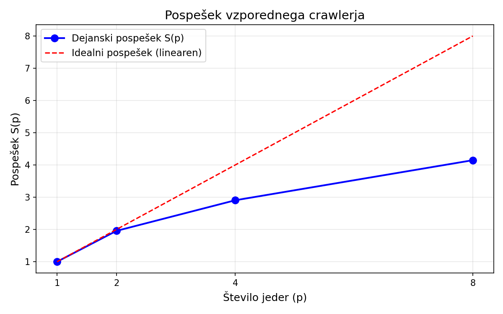
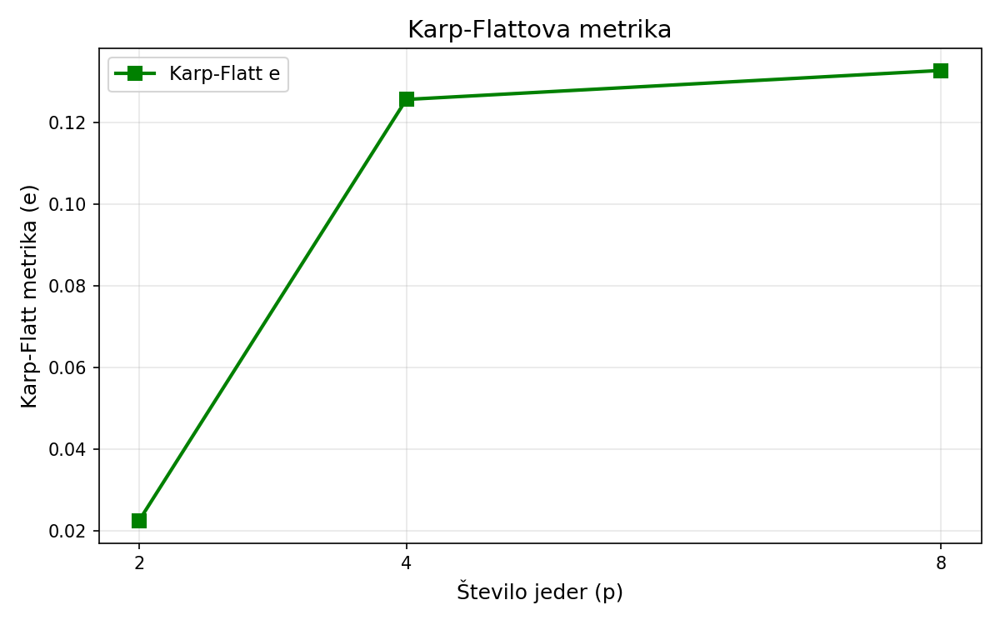
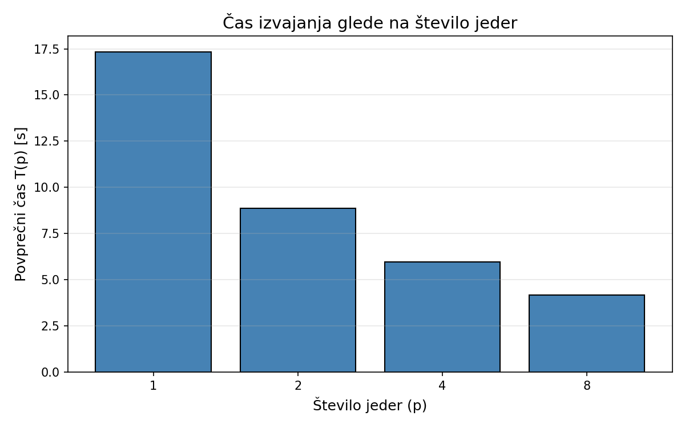
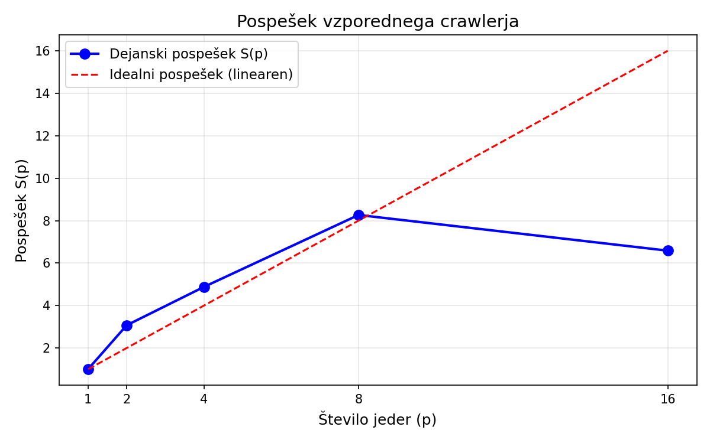
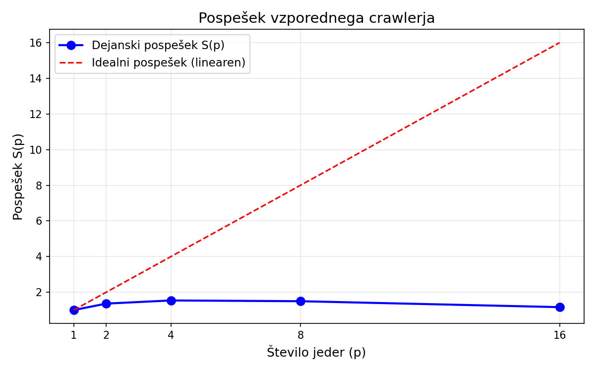

# Vzporedni spletni pajek s sledenjem povezav (Link Crawler)

**Predmet:** Visoko-zmogljivo računalništvo  
**Tehnologija:** Apache Spark (PySpark)

---

## Opis problema

Program implementira vzporedni spletni pajek (web crawler), ki začne z enim izhodiščnim URL naslovom in iterativno sledi hiperpovezavam do vnaprej določene globine. Na vsaki obiskani strani preveri prisotnost izbrane ključne besede. Cilj je demonstrirati uporabo Apache Spark za dinamično upravljanje nalog in porazdeljeno obdelavo nestrukturiranih podatkov z interneta.

### Spark naloga

V vsaki iteraciji (nivo globine) se ustvari RDD iz trenutnega seznama neobiskanih URL-jev. Z uporabo `map` vsak executor vzporedno obišče svojo stran, izvleče hiperpovezave in preveri prisotnost ključne besede. Novo najdene URL-je program zbere, odstrani duplikate z `distinct()` in jih primerja z množico že obiskanih naslovov (`subtract()`), da dobi seznam za naslednjo iteracijo.

### Ključni koncepti
- **Iterativna BFS strategija:** vsak nivo globine = en Spark cikel
- **Deduplikacija:** `distinct()` + `subtract()` za preprečevanje večkratnega obiska
- **Broadcast spremenljivke:** ključna beseda se pošlje executorjem enkrat
- **Dinamično particioniranje:** `numSlices` se prilagodi številu jeder

---

## Struktura projekta

```
spark-crawler/
├── src/
│   ├── crawler.py        # Glavni PySpark crawler
│   └── benchmark.py      # Analiza zmogljivosti
├── results/
│   ├── benchmark_results.csv   # Tabela meritev
│   ├── benchmark_results.json  # Rezultati v JSON
│   ├── speedup.png             # Graf pospeška
│   ├── karp_flatt.png          # Graf Karp-Flatt metrike
│   └── execution_time.png      # Graf časa izvajanja
├── Dockerfile
├── requirements.txt
└── README.md
```

---

## Namestitev in zagon

### Zagon z Dockerjem (priporočeno)

Predpogoj: Docker.

```bash
docker build -t spark-crawler .
docker run --rm -v "$(pwd)/results:/app/results" spark-crawler
```

Privzeti parametri so nastavljeni v `Dockerfile`. Za prilagoditev:
```bash
docker run --rm -v "$(pwd)/results:/app/results" spark-crawler \
  python src/benchmark.py \
  --seed-url "https://github.com/apache/spark" \
  --keyword "apache" \
  --max-depth 2 \
  --max-urls 50 \
  --cores "1,2,4,8" \
  --runs 3 \
  --output-dir results
```

### Zagon brez Dockerja

Predpogoji: Python 3.10+ in Java 11+.

```bash
pip install -r requirements.txt
python src/crawler.py \
  --seed-url "https://github.com/apache/spark" \
  --keyword "apache" \
  --max-depth 2 \
  --max-urls 50 \
  --cores 4
```

### Parametri
| Parameter      | Opis                                      | Privzeto |
|----------------|-------------------------------------------|----------|
| `--seed-url`   | Izhodiščni URL naslov                     | (obvezen)|
| `--keyword`    | Ključna beseda za iskanje                 | (obvezen)|
| `--max-depth`  | Maksimalna globina preiskovanja           | 2        |
| `--max-urls`   | Maks. število URL-jev na nivo globine     | 100      |
| `--cores`      | Število jeder (executorjev)               | 1        |

---

## Rezultati meritev

### Testna konfiguracija
- **Seed URL:** `https://github.com/apache/spark`
- **Ključna beseda:** `apache`
- **Globina:** 2 (seed + 1 nivo povezav)
- **Maks. URL-jev na nivo:** 50
- **Število zagonov:** 3 (za povprečje)
- **Okolje:** Docker (Python 3.11, OpenJDK 21)
- **Strojna oprema:** Apple MacBook Pro 14,2" — Apple M4 Pro, 14 jeder (10 zmogljivostnih + 4 učinkovita), 24 GB RAM, 1 TB SSD, macOS 26.2

### Tabela rezultatov

| Jedra (p) | Zagon 1 [s] | Zagon 2 [s] | Zagon 3 [s] | Povprečje T(p) [s] | Std [s] | Pospešek S(p) | Idealni S(p) | Karp-Flatt e | Strani | Zadetki |
|-----------|-------------|-------------|-------------|---------------------|---------|---------------|-------------|-------------|--------|---------|
| 1         | 33.99       | 10.52       | 11.48       | 18.66               | 13.28   | 1.0000        | 1.0         | 0.000000    | 51     | 25      |
| 2         | 14.60       | 6.49        | 6.35        | 9.15                | 4.73    | 2.0406        | 2.0         | -0.019875   | 51     | 33      |
| 4         | 8.96        | 4.78        | 4.63        | 6.12                | 2.45    | 3.0479        | 4.0         | 0.104125    | 51     | 29      |
| 8         | 8.38        | 3.04        | 3.06        | 4.83                | 3.08    | 3.8667        | 8.0         | 0.152711    | 51     | 35      |

### Pospešek S(p)

#### Primerjava dejanskega in idealnega pospeška

| Niti (p) | Dejanski pospešek S(p) | Idealni pospešek | Odmik |
|----------|------------------------|-------------------|-------|
| 1        | 1.00                   | 1                 | —     |
| 2        | 2.04                   | 2                 | +0.04 (super-linearen) |
| 4        | 3.05                   | 4                 | -0.95 |
| 8        | 3.87                   | 8                 | -4.13 |

Pospešek S(p) pove, kolikokrat hitreje teče program z več nitmi: `S(p) = T(1) / T(p)`. Idealno bi 2 niti pomenili 2x hitrejše, 4 niti 4x hitrejše itd. V praksi se to nikoli ne doseže popolnoma, ker del programa vedno teče zaporedno in ga ni mogoče paralelizirati (Amdahlov zakon).

Rezultati kažejo, da pospešek sledi idealnemu trendu pri manjšem številu niti, nato pa se odmik povečuje. Pri 2 nitih dosežemo pospešek 2.04x (celo rahlo super-linearen), pri 4 nitih 3.05x (namesto 4x), pri 8 nitih pa 3.87x (namesto 8x). Razlogi za odmik:

**1. I/O-bound narava naloge.** Scraping spletnih strani je pretežno omejen z mrežno latenco, ne s procesorsko močjo. Vsaka HTTP zahteva traja 100–500 ms (ali več), kar je neodvisno od števila CPU jeder. Tudi z več executorji čakamo na isti omrežni vmesnik in iste oddaljene strežnike, ki lahko omejujejo število sočasnih povezav z istega IP naslova (rate limiting).

**2. Spark overhead.** Za vsako iteracijo Spark ustvari RDD, serializira naloge, jih razpošlje executorjem in zbere rezultate. Ta režijski strošek je pri majhnem številu nalog (50 URL-jev) relativno velik glede na koristno delo.

**3. Neenakomerna porazdelitev dela (load imbalance).** Spletne strani so zelo različnih velikosti — nekatere vsebujejo na tisoče povezav in veliko besedila, druge so majhne ali nedosegljive. To pomeni, da nekateri executorji končajo delo mnogo prej kot drugi in čakajo.



### Karp-Flattova metrika e

#### Karp-Flatt metrika po številu niti

| Niti (p) | Karp-Flatt e | Pomen |
|----------|-------------|-------|
| 2        | -0.02       | Super-linearen pospešek (verjetno varianca meritev ali predpomnilnik) |
| 4        | 0.10        | ~10% programa je efektivno sekvenčnega |
| 8        | 0.15        | ~15% programa je efektivno sekvenčnega |

Karp-Flattova metrika e iz meritev izračuna dejanski delež programa, ki se obnaša sekvenčno: `e = (1/S(p) - 1/p) / (1 - 1/p)`. Za razliko od Amdahlovega zakona (ki predpostavlja fiksen sekvenčni delež) Karp-Flatt zajame tudi overhead, ki **narašča** z dodajanjem niti.

Če bi bil e konstanten, bi imeli fiksno ozko grlo (klasičen Amdahlov zakon). Naraščanje iz 0.10 na 0.15 pa kaže, da se overhead paralelizacije povečuje z dodajanjem niti — posledica Spark overheada za razporejanje nalog, mrežne konkurence in sinhronizacije med iteracijami. To ni fiksno sekvenčno ozko grlo, temveč rastoč strošek paralelizacije same.

Negativna vrednost pri 2 nitih (-0.02) pomeni, da je bil pospešek rahlo super-linearen (2.04x z 2 nitma), kar se lahko zgodi zaradi učinkov predpomnilnika operacijskega sistema ali naravne variance pri meritvah.



### Čas izvajanja



---

## Identifikacija ozkih grl

1. **Mrežna latenca:** Glavno ozko grlo. HTTP zahteve trajajo 10–100x dlje kot obdelava HTML-ja.
2. **Rate limiting:** Strežniki (npr. GitHub) omejujejo število zahtev na časovno enoto, kar umetno upočasni vzporedno izvajanje.
3. **Spark serializacija:** Overhead za razporejanje in zbiranje nalog pri majhnem obsegu dela.
4. **Deduplikacija med iteracijami:** Operaciji `distinct()` in `subtract()` zahtevata dodatno komunikacijo med executorji.
5. **Sinhronizacija med globinami:** BFS pristop zahteva, da se vse naloge na globini N zaključijo, preden se začne globina N+1. Hitrejši executorji čakajo na počasnejše.

### Možne izboljšave

- Uporaba **asinhronih HTTP zahtev** (aiohttp) namesto sinhronih, kar bi zmanjšalo vpliv mrežne latence
- Povečanje obsega naloge (več URL-jev), kar bi izboljšalo razmerje med koristnim delom in overheadom
- Uporaba **persistentne množice obiskanih URL-jev** z broadcast spremenljivkami namesto collect/parallelize cikla
- Predpomnjenje DNS poizvedb za zmanjšanje latence

---

## Formule

**Pospešek:**
```
S(p) = T(1) / T(p)
```

**Karp-Flattova metrika:**
```
e = (1/S(p) - 1/p) / (1 - 1/p)
```

Kjer je `p` število jeder, `T(1)` čas z enim jedrom in `T(p)` čas s `p` jedri.

---

## Odprta vprašanja in predlogi za profesorja

### Razširjeni testi: sinhroni vs. asinhroni način (max-depth=3, niti 1–16)

Izvedena sta bila dva dodatna benchmarka z globino 3 (101 strani) in konfiguracijami 1, 2, 4, 8, 16 niti — eden s sinhronim načinom (`requests`) in eden z asinhronim (`aiohttp + mapPartitions`).

#### Sinhroni način (depth=3)

| Niti (p) | Zagon 1 [s] | Zagon 2 [s] | Zagon 3 [s] | Povprečje T(p) [s] | Pospešek S(p) | Idealni S(p) | Karp-Flatt e |
|----------|-------------|-------------|-------------|---------------------|---------------|-------------|-------------|
| 1        | 69.72       | 51.47       | 60.90       | 60.70               | 1.00          | 1            | 0.000       |
| 2        | 32.23       | 13.54       | 13.51       | 19.76               | 3.07          | 2            | -0.349      |
| 4        | 21.59       | 7.96        | 7.78        | 12.44               | 4.88          | 4            | -0.060      |
| 8        | 11.67       | 5.22        | 5.14        | 7.34                | 8.27          | 8            | -0.005      |
| 16       | 17.35       | 5.58        | 4.72        | 9.22                | 6.59          | 16           | 0.095       |



#### Asinhroni način (depth=3)

| Niti (p) | Zagon 1 [s] | Zagon 2 [s] | Zagon 3 [s] | Povprečje T(p) [s] | Pospešek S(p) | Idealni S(p) | Karp-Flatt e |
|----------|-------------|-------------|-------------|---------------------|---------------|-------------|-------------|
| 1        | 14.03       | 5.17        | 5.19        | 8.13                | 1.00          | 1            | 0.000       |
| 2        | 7.95        | 5.15        | 4.81        | 5.97                | 1.36          | 2            | 0.469       |
| 4        | 4.28        | 7.30        | 4.27        | 5.28                | 1.54          | 4            | 0.533       |
| 8        | 7.16        | 4.84        | 4.30        | 5.43                | 1.50          | 8            | 0.621       |
| 16       | 6.69        | 9.74        | 4.53        | 6.99                | 1.16          | 16           | 0.850       |



### Analiza rezultatov

#### 1. Navidezno super-linearen pospešek v sinhronem načinu

Sinhroni rezultati kažejo pospešek nad idealnim (3.07x pri 2 nitih, 4.88x pri 4 nitih, 8.27x pri 8 nitih). To je **merilni artefakt**, ne dejanski super-linearen pospešek. Razlog je v tem, da benchmark vedno začne s konfiguracijo z 1 nitjo. Prvi zagon (69.72s) je drastično počasnejši od ostalih zaradi:

- **Hladnega zagona JVM:** Spark teče na JVM, ki ob prvem zagonu nalaga razrede in JIT-prevaja kodo.
- **DNS in TCP predpomnilnika:** Ob prvem zagonu se DNS poizvedbe in TCP povezave vzpostavljajo na novo. Naslednje konfiguracije (2, 4, 8 niti) že koristijo predpomnilnik operacijskega sistema.
- **Strežniškega predpomnilnika:** GitHub vrača odgovore hitreje ob ponovljenem dostopu.

Te učinki nesorazmerno napihajo T(1), kar umetno zviša vse pospešitve. Visoka standardna deviacija (9–11s pri 1 in 2 nitih) potrjuje nestabilnost meritev. Če bi primerjali samo 2. in 3. zagon, bi bili pospešitve bistveno bližje idealnim vrednostim.

**Predlog:** Uvesti ogrevalni (warmup) zagon, ki se zavrže, tako da bi T(1) temeljil na ponovljivih meritvah.

#### 2. Degradacija zmogljivosti pri 16 nitih (sinhroni način)

Pri 16 nitih je povprečni čas 9.22s — **slabše kot pri 8 nitih** (7.34s). Pospešek pade iz 8.27x na 6.59x. To kaže, da smo presegli točko koristne paralelizacije. Razlogi:

- Računalnik ima 14 fizičnih jeder (10 zmogljivostnih + 4 učinkovita). Pri 16 nitih se niti tekmujejo za jedra in operacijski sistem porablja čas za preklapljanje.
- Spark overhead za razporejanje 32 particij (16 × 2) presega pridobitve paralelizacije.
- GitHub intenzivneje omejuje sočasne zahteve z istega IP naslova.

#### 3. Asinhroni način drastično zmanjša bazni čas

Ključna ugotovitev: async T(1) = **8.13s** vs. sync T(1) = **60.70s** — asinhroni način z eno samo nitjo je **7.5x hitrejši** od sinhronega z eno nitjo. Razlog: v sinhronem načinu 1 nit obdela URL-je zaporedno (čaka na vsak HTTP odgovor), medtem ko v asinhronem načinu 1 nit pošlje vse zahteve hkrati in čaka le na najdaljši odgovor.

Še bolj zgovorno: async T(1) = 8.13s je primerljiv s sync T(8) = 7.34s. To pomeni, da **asinhroni način z 1 nitjo doseže skoraj enako zmogljivost kot sinhroni z 8 nitmi**.

#### 4. Dodajanje niti v asinhronem načinu ne pomaga

Pospešek v asinhronem načinu je minimalen: 1.36x pri 2 nitih, 1.54x pri 4, 1.50x pri 8, pri 16 pa celo **pade pod 1** (1.16x). Karp-Flatt metrika je zelo visoka (0.47–0.85) in strmo narašča. To pomeni, da je efektivni sekvenčni delež programa 47–85%.

Razlog: async že znotraj ene particije odpravlja I/O ozko grlo. Ko dodajaš Spark niti, ne odpravljaš ozkega grla — le dodajaš Spark overhead (razporejanje, serializacija, zbiranje), ki postane dominanten strošek.

#### 5. Popoln zlom pri 16 nitih v asinhronem načinu

Pri 16 nitih + async je v 1. zagonu GitHub vrnil **HTTP 429 (Too Many Requests)** že za seed URL. Namesto 101 strani je crawler obiskal le **54 strani z 0 zadetki ključne besede**. Razlog: 16 niti × do 10 sočasnih povezav na particijo = do **160 hkratnih HTTP zahtev** na GitHub, ki je aktiviral rate limiting. V logu je vidno 149 napak (vs. 19 pri sinhronem načinu).